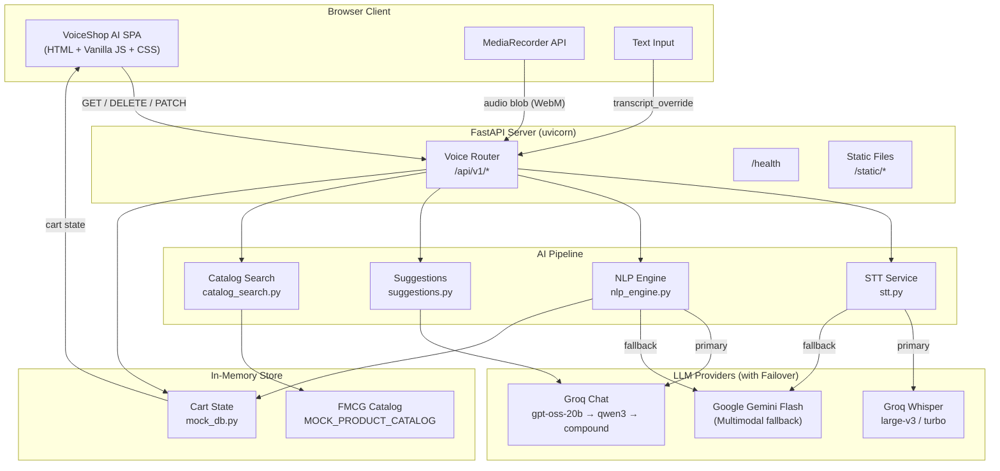
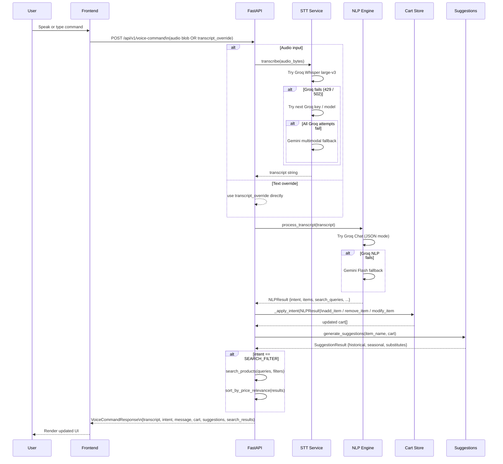
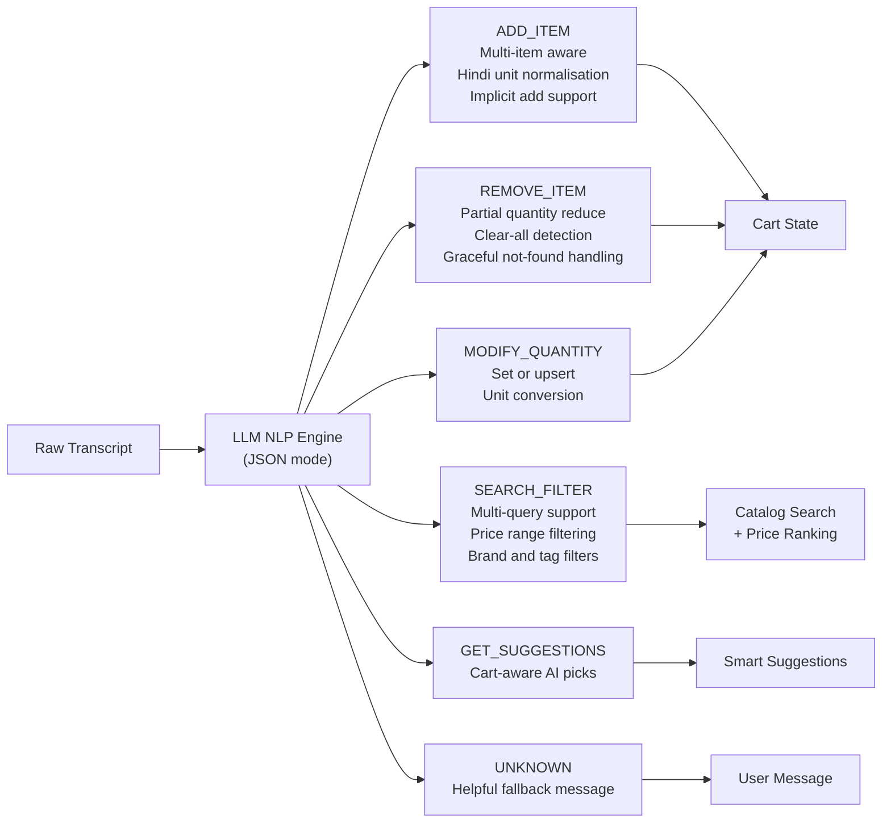
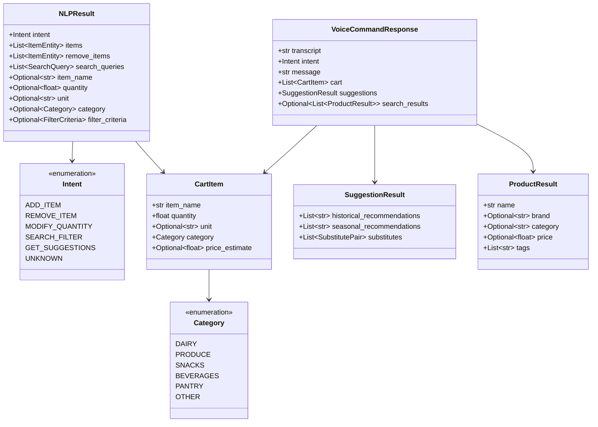

<div align="center">

# VoiceShop AI

### Voice Command Shopping Assistant

**A production-grade, multilingual AI shopping assistant powered by Groq Whisper (STT), Llama / GPT (NLP), and Gemini Flash — featuring real-time cart management, smart suggestions, and FMCG product search.**

[](https://python.org)
[](https://fastapi.tiangolo.com)
[](https://groq.com)
[](https://ai.google.dev)
[](LICENSE)

</div>

---

## Live Demo

Experience the live interactive web application:

**[https://voice-command-shopping-assisstant.vercel.app/](https://voice-command-shopping-assisstant.vercel.app/)**

---

## Overview

VoiceShop AI is a **full-stack intelligent shopping assistant** that allows users to manage their grocery lists through **natural spoken or typed language** — in both English and Hindi/Hinglish. The system processes voice audio through a **multi-provider AI pipeline** (Groq Whisper → LLM NLP → Gemini fallback) to extract structured intents, manage a live shopping cart, generate context-aware suggestions, and search an FMCG product catalog — all in a single API call.

### What Makes It Different

| Feature | Description |
|---|---|
| Real-time STT | Groq Whisper Large-v3 with Gemini multimodal fallback |
| Multi-intent NLP | Extracts 6 intent types from one utterance |
| Bilingual Support | English + Hindi / Hinglish with automatic translation |
| Multi-item Commands | "Add 10kg rice, 2L milk, 3 dozen eggs" handled in a single call |
| API Key Rotation | Key pool with automatic failover on rate limits |
| Zero-LLM UI Operations | Quantity controls and item removal bypass LLM entirely |

---

## Engineering Approach

The system is designed around a **single-responsibility service layer** where each concern — speech transcription, natural language understanding, suggestion generation, and catalog search — lives in its own isolated module with a well-defined async interface. This makes individual components independently testable and replaceable without touching the rest of the pipeline.

Resilience is a first-class concern. Every external LLM call is wrapped in a **multi-key rotation pool** that iterates over up to ten API keys per provider before escalating to the next provider in the cascade. This eliminates downtime caused by rate limits (HTTP 429) or transient provider outages (HTTP 502/503), and the failover is fully transparent to the frontend.

Cart state is intentionally kept **in-memory** for this version. The `mock_db.py` module exposes a clean CRUD interface (`add_item`, `remove_item`, `modify_item`, `get_cart`, `clear_cart`) that can be swapped for a persistent store (Redis, PostgreSQL) with no changes to the router or service layers.

On the frontend, **UI-driven cart operations** (quantity increment/decrement, per-item removal) call lightweight `PATCH` and `DELETE` endpoints directly, bypassing the LLM pipeline entirely. This keeps perceived latency under 100 ms for the most frequent user actions, reserving the heavier AI pipeline only for voice and text command processing.

Pydantic v2 enforces a **strict schema boundary** at every API surface. All LLM JSON outputs are validated against typed models before touching cart state, preventing malformed AI responses from corrupting application data.

---

## Live Screenshots

### 1 — Home Dashboard (Empty State)
> The main dashboard on first load. The voice microphone is ready, example commands are displayed as hints, and the Quick Picks panel loads AI-generated suggestions in the background.


---

### 2 — Shopping List with Items (Multi-item Add)
> After the command `"Add 2 kg rice, 1 litre milk, 500g sugar, 3 dozen bananas"` — the AI extracts all 4 items simultaneously, categorises each one, and renders product cards with quantity controls.


---

### 3 — Store Product Catalog
> Full FMCG product catalog browsable by category filter chips (Dairy, Produce, Snacks, Beverages, Pantry). Each card shows brand, price, and a direct Add to Cart action.


---

### 4 — AI-Powered Search Results (Price Filter)
> After the command `"Find Amul milk under 100 rupees"` — the `SEARCH_FILTER` intent is extracted, the catalog is queried, results are ranked by price relevance, and substitutes appear in the Quick Picks panel.


---

## Key Features Implemented

### Real-time Speech-to-Text
- Browser `MediaRecorder` API streams audio blobs (WebM / WAV / MP3 / M4A) to the backend
- **Groq Whisper Large-v3** is the primary transcription engine, delivering sub-second latency
- Automatic failover to **Whisper Large-v3-turbo** and then **Google Gemini multimodal audio** if Groq is unavailable
- Maximum audio payload size validated server-side at **25 MB** (HTTP 413 on breach)
- `transcript_override` field lets developers bypass STT entirely for text-based testing

### Six-Intent NLP Engine
The LLM extracts one of six discrete intents from every utterance, enforcing a strict JSON schema via Groq JSON mode and Gemini MIME-typed output:

| Intent | Capability |
|---|---|
| `ADD_ITEM` | Multi-item extraction from a single command; implicit add when no verb is present |
| `REMOVE_ITEM` | Full removal or partial quantity reduction; detects "clear all" variants |
| `MODIFY_QUANTITY` | Set or upsert quantity; unit-aware (kg, litres, dozens) |
| `SEARCH_FILTER` | Multi-query search with brand, price range, and tag filters |
| `GET_SUGGESTIONS` | Cart-aware personalised recommendation trigger |
| `UNKNOWN` | Graceful degradation with a descriptive fallback message |

### Multi-item and Simultaneous Operations
- A single command such as `"Add 2 kg rice and remove 1 litre milk"` resolves both an addition and a removal in one API call
- The `items` array and `remove_items` array in `NLPResult` are processed sequentially with atomic cart mutations
- Multi-query search (`"Find butter and cheese under Rs 150"`) fans out into parallel catalog queries that are deduplicated and merged before returning

### Hindi and Hinglish Language Support
- Full support for Devanagari script and romanised Hinglish in a single pipeline
- Desi unit normalisation applied before cart insertion:

| Input Unit | Normalised Value |
|---|---|
| `dazan` | 12 pieces |
| `paav` | 250 g |
| `aadha kg` | 500 g |
| `quintal` | 100 kg |
| `tola` | 10 g |

- All Hindi item names are translated to English by the LLM before storage, keeping the cart and catalog in a consistent language

### Multi-Provider API Key Failover
- Each provider (Groq, Gemini) supports a **key pool of up to 10 keys** loaded from numbered environment variables (`GROQ_API_KEY`, `GROQ_API_KEY2`, ... `GROQ_API_KEY10`)
- On any 429 or 5xx response, the engine rotates to the next key in the pool before escalating to the next model variant, then to the next provider
- The entire failover sequence is transparent to the frontend — the API always returns a valid response or a structured error

### Smart Suggestions Engine
- On every voice command, the suggestions service generates three categories of recommendations: **historical restock items**, **seasonal picks**, and **smart substitutes** with human-readable reasons
- Suggestions are cart-context-aware — the current cart contents are serialised and passed to the LLM prompt so recommendations are personalised, not generic
- The right-hand Quick Picks panel updates on every command response without a separate API call

### FMCG Product Catalog and Search
- Full in-memory FMCG catalog with brand, category, price, and tag metadata per product
- Two-layer search: name/brand fuzzy match followed by tag intersection, returning a union of both result sets
- Results are **sorted by price relevance** — closest to the user's stated price constraint ranked first
- Category filter chips on the Store Catalog view filter the grid client-side with no additional API calls

### Zero-LLM UI Operations
- Quantity `+` / `-` controls call `PATCH /api/v1/cart/items/{name}` with a `delta` field — pure in-memory arithmetic, no LLM involved
- Per-item remove buttons call `DELETE /api/v1/cart/{name}` — resolves in under 5 ms with no transcript banner side-effect
- Direct catalog "Add to Cart" buttons call `POST /api/v1/cart/items` — bypasses the full voice pipeline, keeping UI interactions instant

### Strict Schema Validation
- Every LLM JSON response is validated through **Pydantic v2** models before any cart mutation occurs
- Quantity fields are constrained to positive floats (`gt=0`); invalid LLM outputs raise a structured 422 error rather than corrupting state
- The `Intent` and `Category` fields are typed enumerations — unknown values default to `UNKNOWN` / `OTHER` gracefully

---

## System Architecture



---

## AI Pipeline



---

## NLP Intent System



---

## Data Models



---

## API Reference

Base URL: `http://localhost:8000`
Interactive Docs: [`/docs`](http://localhost:8000/docs) (Swagger UI)

### Endpoints

| Method | Path | Description |
|--------|------|-------------|
| `GET` | `/health` | Service health check and version |
| `POST` | `/api/v1/voice-command` | Full pipeline: STT → NLP → cart → suggestions |
| `GET` | `/api/v1/cart` | Fetch current shopping list |
| `POST` | `/api/v1/cart/items` | Direct add item (no LLM) |
| `PATCH` | `/api/v1/cart/items/{name}` | Direct quantity modify (no LLM) |
| `DELETE` | `/api/v1/cart/{name}` | Remove single item silently |
| `DELETE` | `/api/v1/cart` | Clear entire shopping list |
| `GET` | `/api/v1/suggestions` | On-demand AI suggestions |
| `GET` | `/api/v1/catalog` | Full FMCG product catalog |

### POST /api/v1/voice-command

**Request** (multipart/form-data):

```
audio              : file   (WebM / WAV / MP3 / M4A — max 25 MB)
transcript_override: string (bypasses STT for text-based testing)
```

**Response** (`VoiceCommandResponse`):

```json
{
  "transcript": "Add 2 kg rice and 1 litre milk",
  "intent": "ADD_ITEM",
  "message": "Added 2 items: 2 kg rice, 1 litre milk.",
  "cart": [
    { "item_name": "rice", "quantity": 2.0, "unit": "kg",    "category": "Pantry" },
    { "item_name": "milk", "quantity": 1.0, "unit": "litre", "category": "Dairy"  }
  ],
  "suggestions": {
    "historical_recommendations": ["atta", "dal"],
    "seasonal_recommendations": ["mango", "watermelon"],
    "substitutes": [
      { "original": "milk", "substitute": "oat milk", "reason": "Lactose-free alternative" }
    ]
  },
  "search_results": null
}
```

---

## Project Structure

```
Voice-Command-Shopping-Assistant-main/
|-- app/
|   |-- __init__.py
|   |-- main.py               # FastAPI application factory and lifespan
|   |-- config.py             # Environment variables, API key pools, model identifiers
|   |-- models.py             # Pydantic data models (NLPResult, CartItem, ...)
|   |-- data/
|   |   `-- mock_db.py        # In-memory cart store and FMCG product catalog
|   |-- routers/
|   |   `-- voice.py          # All API route handlers (9 endpoints)
|   `-- services/
|       |-- stt.py            # Speech-to-Text: Groq Whisper + Gemini fallback
|       |-- nlp_engine.py     # Intent/entity extraction: Groq Chat + Gemini fallback
|       |-- suggestions.py    # AI-generated smart suggestions
|       `-- catalog_search.py # FMCG product search and price-relevance ranking
|-- static/
|   |-- index.html            # Single-page frontend (semantic HTML5)
|   |-- style.css             # Glassmorphism dark UI (Outfit font, teal accents)
|   `-- app.js                # Frontend logic (MediaRecorder, cart rendering, views)
|-- screenshots/              # UI screenshots for documentation
|-- .env.example              # Environment variable template
|-- requirements.txt          # Python dependencies
`-- README.md
```

---

## Getting Started

### Prerequisites

- Python 3.11 or higher
- A Groq API key (free tier available at [console.groq.com](https://console.groq.com))
- A Google Gemini API key (free at [ai.google.dev](https://ai.google.dev))
- A modern browser with microphone access (Chrome, Edge, Firefox)

### Installation

```bash
# 1. Clone the repository
git clone https://github.com/Swayam-Burde/Voice-Command-Shopping-Assisstant.git
cd Voice-Command-Shopping-Assisstant

# 2. Create and activate virtual environment
python -m venv venv

# Windows
venv\Scripts\activate

# macOS / Linux
source venv/bin/activate

# 3. Install dependencies
pip install -r requirements.txt

# 4. Configure environment variables
cp .env.example .env
# Edit .env and add your API keys (see Environment Variables section below)

# 5. Run the development server
uvicorn app.main:app --reload --port 8000
```

Open [http://localhost:8000](http://localhost:8000) in your browser.
Swagger API docs available at [http://localhost:8000/docs](http://localhost:8000/docs).

---

## Environment Variables

Copy `.env.example` to `.env` and populate with your keys:

```env
# Groq (Primary — STT + NLP)
GROQ_API_KEY=gsk_xxxxxxxxxxxxxxxxxxxx
# Optional: add up to 10 keys for rate-limit rotation
GROQ_API_KEY2=gsk_yyyyyyyyyyyyyyyyyyyy
GROQ_API_KEY3=gsk_zzzzzzzzzzzzzzzzzzzz

# Google Gemini (Fallback — STT multimodal + NLP)
GEMINI_API_KEY=AIzaSy_xxxxxxxxxxxxxxxxxxxx
GEMINI_API_KEY2=AIzaSy_yyyyyyyyyyyyyyyyyy
```

The application supports up to **10 keys per provider** (`KEY`, `KEY2`, `KEY3`, through `KEY10`). Keys are rotated automatically on 429 or 5xx errors.

---

## Test Cases and Edge Cases

The following scenarios were tested against the live API using the `transcript_override` field.

### Standard Test Cases

| # | Command | Expected Intent | Result |
|---|---------|-----------------|--------|
| 1 | `"Add 2 kg rice"` | `ADD_ITEM` | Added 2 kg rice to cart |
| 2 | `"Add 10 kg moong dal, 20 kg rice, 5 litres oil"` | `ADD_ITEM` | 3 items added simultaneously |
| 3 | `"Remove milk"` | `REMOVE_ITEM` | Item removed from cart |
| 4 | `"Change rice to 5 kg"` | `MODIFY_QUANTITY` | Quantity updated; upserts if not in cart |
| 5 | `"Find Heinz ketchup under Rs 200"` | `SEARCH_FILTER` | Filtered and price-ranked results returned |
| 6 | `"What should I buy?"` | `GET_SUGGESTIONS` | Cart-aware AI suggestions returned |
| 7 | `"Clear my shopping list"` | `REMOVE_ITEM` | Entire cart cleared |

### Hindi and Hinglish Test Cases

| # | Command | Expected Behaviour |
|---|---------|-------------------|
| 1 | `"2 dazan aam aur 10 kg aata add karo"` | 24 mangoes and 10 kg atta added |
| 2 | `"Doodh aur chawal hatao"` | Milk and rice removed |
| 3 | `"Paav kg pyaaz chahiye"` | 250 g onion added |
| 4 | `"Organic doodh Rs 100 ke andar dhundo"` | `SEARCH_FILTER` with tag=organic, max_price=100 |
| 5 | `"Ek quintal aata"` | 100 kg atta added (quintal normalised) |

### Edge Cases

| # | Command | Expected Behaviour |
|---|---------|-------------------|
| 1 | Empty string / silence | `UNKNOWN` — "No speech detected" message returned |
| 2 | `"xyzzy frobble gloop"` | `UNKNOWN` — graceful "didn't understand" message |
| 3 | `"Remove tomatoes"` (not in cart) | `REMOVE_ITEM` — "Not found: tomatoes" in response |
| 4 | Quantity <= 0 submitted via API | Pydantic validation error — 422 Unprocessable Entity |
| 5 | `"Add milk and also remove eggs"` | Simultaneous add and remove resolved in one command |
| 6 | `"Find iPhone under Rs 100"` | `SEARCH_FILTER` — 0 results, empty grid displayed |
| 7 | `"Add 2 dazan aam, remove 1 litre milk, find Amul butter under Rs 100"` | Multi-intent: add + remove + search in a single utterance |

---

## Technology Stack

| Layer | Technology | Purpose |
|-------|-----------|---------|
| Frontend | HTML5, Vanilla CSS, JavaScript | Single-page application, MediaRecorder API |
| Web Framework | FastAPI 0.110+ | Async REST API, automatic OpenAPI documentation |
| ASGI Server | Uvicorn with watchfiles | Production-grade asynchronous server |
| STT Primary | Groq Whisper Large-v3 | High-accuracy speech-to-text transcription |
| STT Fallback | Google Gemini multimodal | Audio transcription fallback via google-genai SDK |
| NLP Primary | Groq Chat (gpt-oss-20b, qwen3) | JSON-mode intent and entity extraction |
| NLP Fallback | Google Gemini Flash | LLM fallback with MIME-typed JSON output |
| Data Validation | Pydantic v2 | Strict schema enforcement across all models |
| Font | Outfit (Google Fonts) | Modern geometric sans-serif typeface |
| Configuration | python-dotenv | Multi-key pool loading from .env |

---

## Contributing

1. Fork the repository
2. Create your feature branch: `git checkout -b feature/your-feature-name`
3. Commit your changes: `git commit -m 'feat: add your feature description'`
4. Push to the branch: `git push origin feature/your-feature-name`
5. Open a Pull Request

---

## License

This project is licensed under the **MIT License** — see [LICENSE](LICENSE) for details.

---

<div align="center">

Built by [Swayam Burde](https://github.com/Swayam-Burde)

Powered by Groq · Google Gemini · FastAPI

</div>
