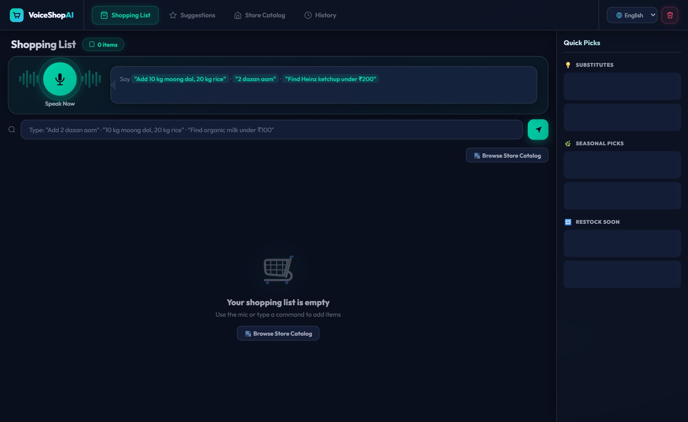
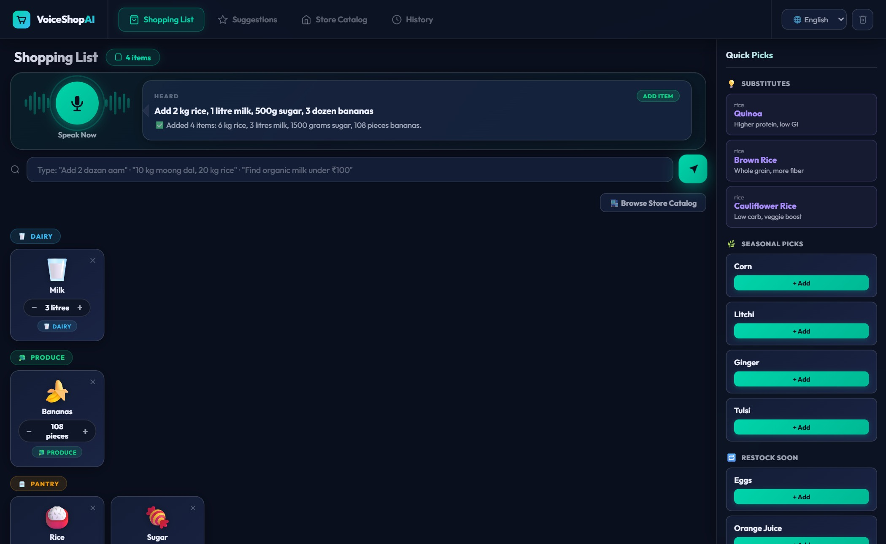
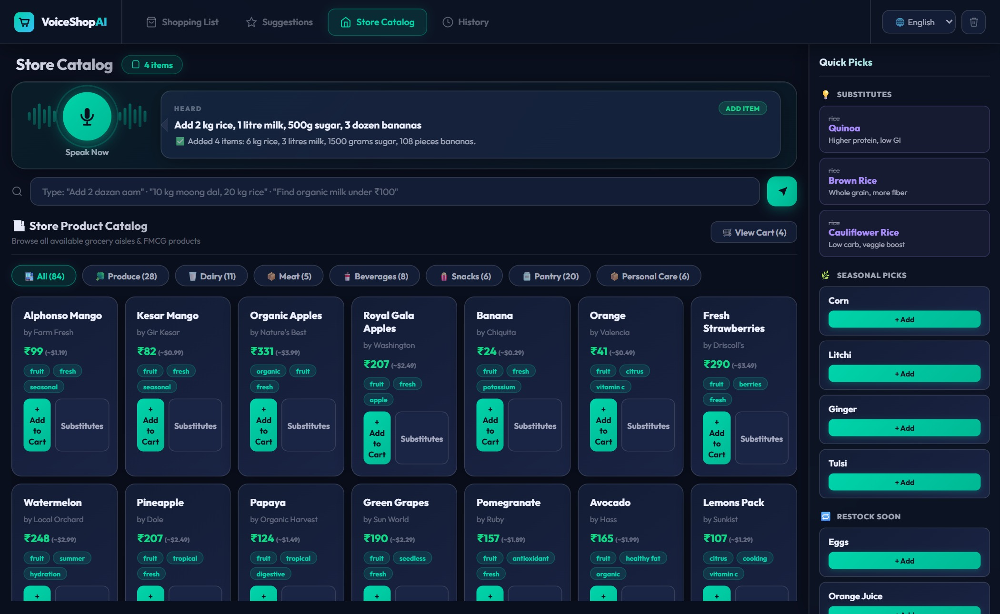
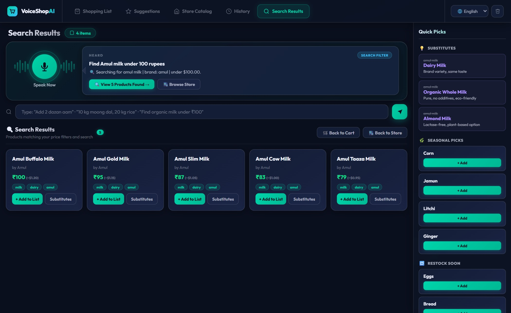
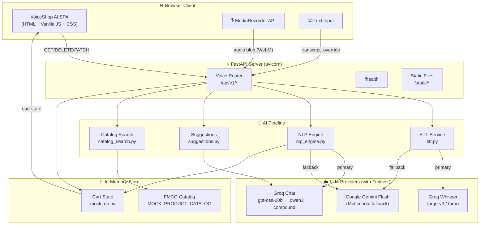
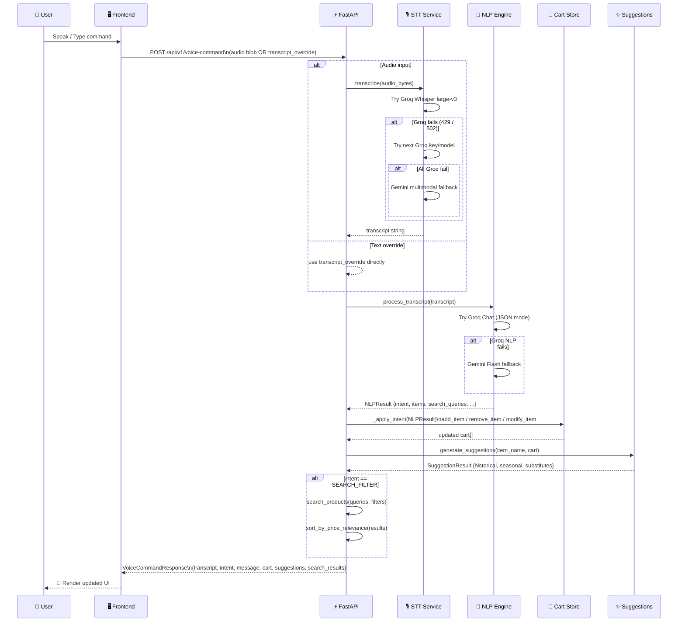
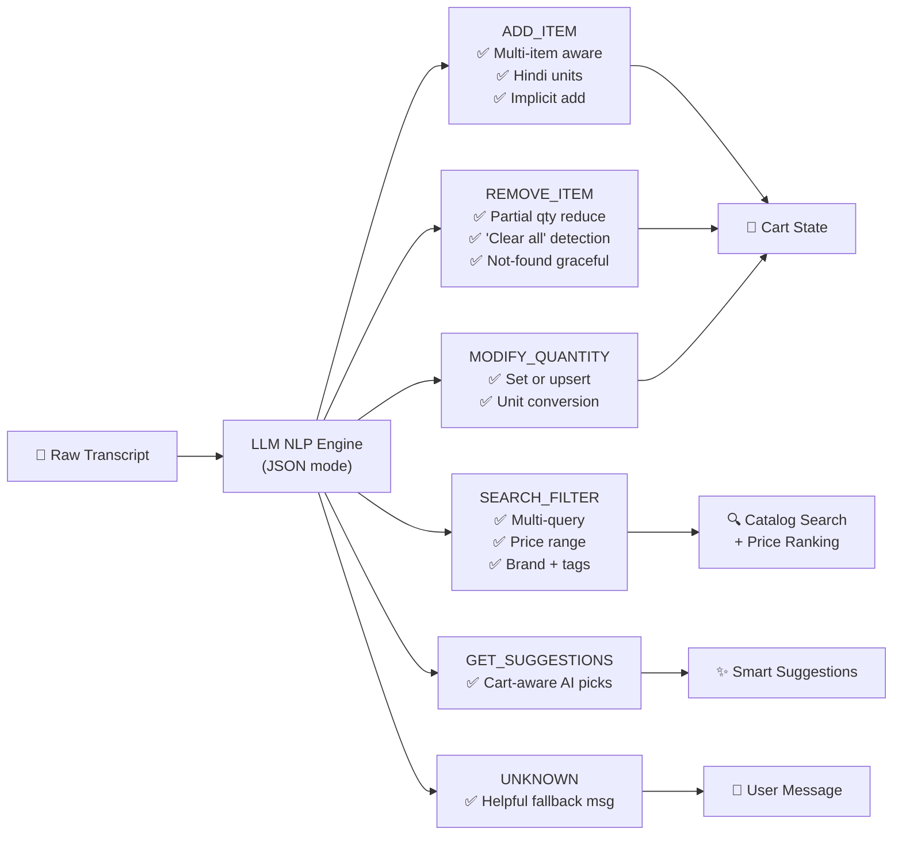
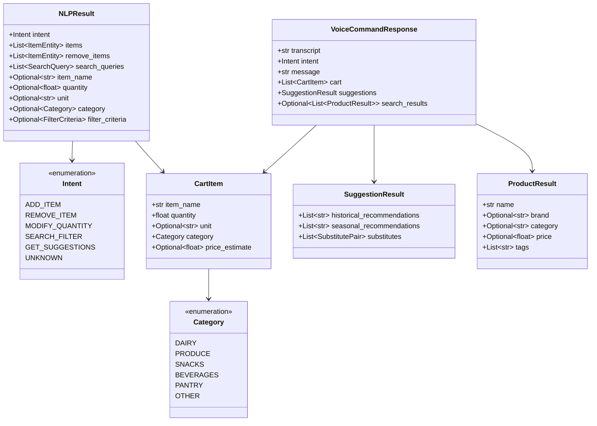

<div align="center">

# 🛒 VoiceShop AI

### Voice Command Shopping Assistant

**A production-grade, multilingual AI shopping assistant powered by Groq Whisper (STT), Llama / GPT (NLP), and Gemini Flash — featuring real-time cart management, smart suggestions, and FMCG product search.**

[](https://python.org)
[](https://fastapi.tiangolo.com)
[](https://groq.com)
[](https://ai.google.dev)
[](LICENSE)

</div>

---

## 📋 Table of Contents

- [Overview](#-overview)
- [Live Screenshots](#-live-screenshots)
- [Key Features](#-key-features)
- [System Architecture](#-system-architecture)
- [API Reference](#-api-reference)
- [NLP Intent System](#-nlp-intent-system)
- [Data Models](#-data-models)
- [AI Pipeline](#-ai-pipeline)
- [Project Structure](#-project-structure)
- [Getting Started](#-getting-started)
- [Environment Variables](#-environment-variables)
- [Test Cases & Edge Cases](#-test-cases--edge-cases)
- [Technology Stack](#-technology-stack)

---

## 🌟 Overview

VoiceShop AI is a **full-stack intelligent shopping assistant** that allows users to manage their grocery lists through **natural spoken or typed language** — in both English and Hindi/Hinglish. The system processes voice audio through a **multi-provider AI pipeline** (Groq Whisper → LLM NLP → Gemini fallback) to extract structured intents, manage a live shopping cart, generate context-aware suggestions, and search an FMCG product catalog — all in a single API call.

### What Makes It Different

| Feature | Description |
|---|---|
| 🎙️ Real-time STT | Groq Whisper Large-v3 with Gemini multimodal fallback |
| 🧠 Multi-intent NLP | Extracts 6 intent types from one utterance |
| 🇮🇳 Bilingual | English + Hindi / Hinglish with auto-translation |
| 🔄 Multi-item | "Add 10kg rice, 2L milk, 3 dozen eggs" → single call |
| 🔑 Key Rotation | API key pool with automatic failover |
| ⚡ Zero-LLM UI ops | Quantity +/- and item remove bypass LLM entirely |

---

## 📸 Live Screenshots

### 1 — Home Dashboard (Empty State)
> The main dashboard on first load. The voice mic is ready, hint examples are shown, and the Quick Picks panel starts loading AI suggestions.



---

### 2 — Shopping List with Items (Multi-item Add)
> After the voice/text command `"Add 2 kg rice, 1 litre milk, 500g sugar, 3 dozen bananas"` — the AI extracts all 4 items simultaneously, categorises them, and renders responsive product cards with quantity controls.



---

### 3 — Store Product Catalog
> Full FMCG product catalog browsable by category chips (Dairy, Produce, Snacks, Beverages, Pantry). Each card shows brand, price, and a direct "Add to Cart" action.



---

### 4 — AI-Powered Search Results (Price Filter)
> After the command `"Find Amul milk under 100 rupees"` — the `SEARCH_FILTER` intent is extracted, the catalog is searched, results are ranked by price relevance, and substitutes are shown in the Quick Picks panel.



---

## ✨ Key Features

<details>
<summary><strong>🎙️ Voice & Text Input</strong></summary>

- Browser MediaRecorder API captures audio (WebM/WAV/MP3/M4A)
- Groq Whisper Large-v3 provides industry-leading STT accuracy
- `transcript_override` field for text-only mode (no LLM token cost for testing)
- Max audio file size: **25 MB** (enforced server-side)

</details>

<details>
<summary><strong>🧠 6-Intent NLP Engine</strong></summary>

| Intent | Example Command |
|---|---|
| `ADD_ITEM` | "Add 2 kg moong dal and 3 litres of oil" |
| `REMOVE_ITEM` | "Remove bananas and reduce milk to 1 litre" |
| `MODIFY_QUANTITY` | "Change rice to 5 kg" |
| `SEARCH_FILTER` | "Find Heinz ketchup under ₹200 organic" |
| `GET_SUGGESTIONS` | "What should I buy this season?" |
| `UNKNOWN` | Ambiguous/empty fallback with helpful message |

</details>

<details>
<summary><strong>🇮🇳 Hindi / Hinglish Support</strong></summary>

- Desi unit normalisation: `dazan` → 12 pcs, `paav` → 250g, `quintal` → 100 kg
- Item names auto-translated to English for storage
- Mixed language: "2 kg atta aur 1 litre doodh add karo"

</details>

<details>
<summary><strong>🔄 Multi-Provider Failover</strong></summary>

- **STT**: Groq Whisper large-v3 → Whisper large-v3-turbo → Gemini multimodal
- **NLP**: Groq (gpt-oss-20b, qwen3.6-27b, compound-mini) → Gemini Flash
- **Key Pool**: Up to 10 API keys per provider (env vars: `GROQ_API_KEY`, `GROQ_API_KEY2`, ...)

</details>

<details>
<summary><strong>⚡ Zero-LLM Cart Operations</strong></summary>

- **Quantity +/-**: `PATCH /api/v1/cart/items/{name}` — pure in-memory, 0ms LLM overhead
- **Remove item**: `DELETE /api/v1/cart/{name}` — instant, no transcript banner
- **Clear all**: `DELETE /api/v1/cart`

</details>

---

## 🏗️ System Architecture



---

## 🔄 AI Pipeline



---

## 🗂️ NLP Intent System



---

## 📦 Data Models



---

## 🔌 API Reference

Base URL: `http://localhost:8000`  
Interactive Docs: [`/docs`](http://localhost:8000/docs) (Swagger UI)

### Endpoints

| Method | Path | Description |
|--------|------|-------------|
| `GET` | `/health` | Service health check & version |
| `POST` | `/api/v1/voice-command` | Full pipeline: STT → NLP → cart → suggestions |
| `GET` | `/api/v1/cart` | Fetch current shopping list |
| `POST` | `/api/v1/cart/items` | Direct add item (no LLM) |
| `PATCH` | `/api/v1/cart/items/{name}` | Direct quantity modify (no LLM) |
| `DELETE` | `/api/v1/cart/{name}` | Remove single item silently |
| `DELETE` | `/api/v1/cart` | Clear entire shopping list |
| `GET` | `/api/v1/suggestions` | On-demand AI suggestions |
| `GET` | `/api/v1/catalog` | Full FMCG product catalog |

### `POST /api/v1/voice-command`

**Request** (multipart/form-data):
```
audio             : file   (WebM / WAV / MP3 / M4A — max 25MB)
transcript_override: string (bypasses STT for testing)
```

**Response** (`VoiceCommandResponse`):
```json
{
  "transcript": "Add 2 kg rice and 1 litre milk",
  "intent": "ADD_ITEM",
  "message": "✅ Added 2 items: 2 kg rice, 1 litre milk.",
  "cart": [
    { "item_name": "rice",  "quantity": 2.0, "unit": "kg",    "category": "Pantry" },
    { "item_name": "milk",  "quantity": 1.0, "unit": "litre", "category": "Dairy"  }
  ],
  "suggestions": {
    "historical_recommendations": ["atta", "dal"],
    "seasonal_recommendations": ["mango", "watermelon"],
    "substitutes": [
      { "original": "milk", "substitute": "oat milk", "reason": "Lactose-free alternative" }
    ]
  },
  "search_results": null
}
```

---

## 📁 Project Structure

```
Voice-Command-Shopping-Assistant-main/
├── app/
│   ├── __init__.py
│   ├── main.py               # FastAPI application factory & lifespan
│   ├── config.py             # Env vars, API key pools, model identifiers
│   ├── models.py             # Pydantic data models (NLPResult, CartItem, ...)
│   ├── data/
│   │   └── mock_db.py        # In-memory cart store + FMCG product catalog
│   ├── routers/
│   │   └── voice.py          # All API route handlers (9 endpoints)
│   └── services/
│       ├── stt.py            # Speech-to-Text: Groq Whisper + Gemini fallback
│       ├── nlp_engine.py     # Intent/entity extraction: Groq Chat + Gemini fallback
│       ├── suggestions.py    # AI-generated smart suggestions
│       └── catalog_search.py # FMCG product search + price-relevance ranking
├── static/
│   ├── index.html            # Single-page frontend (semantic HTML5)
│   ├── style.css             # Glassmorphism dark UI (Outfit font, teal accents)
│   └── app.js                # Frontend logic (MediaRecorder, cart rendering, views)
├── screenshots/              # UI screenshots for documentation
├── .env.example              # Environment variable template
├── requirements.txt          # Python dependencies
└── README.md
```

---

## 🚀 Getting Started

### Prerequisites

- Python **3.11+**
- A **Groq API key** (free tier available at [console.groq.com](https://console.groq.com))
- A **Google Gemini API key** (free at [ai.google.dev](https://ai.google.dev))
- A modern browser with microphone access (Chrome, Edge, Firefox)

### Installation

```bash
# 1. Clone the repository
git clone https://github.com/Swayam-Burde/Voice-Command-Shopping-Assisstant.git
cd Voice-Command-Shopping-Assisstant

# 2. Create and activate virtual environment
python -m venv venv

# Windows
venv\Scripts\activate

# macOS / Linux
source venv/bin/activate

# 3. Install dependencies
pip install -r requirements.txt

# 4. Configure environment variables
cp .env.example .env
# Edit .env and add your API keys (see Environment Variables section)

# 5. Run the development server
uvicorn app.main:app --reload --port 8000
```

Open [http://localhost:8000](http://localhost:8000) in your browser.  
Swagger API docs: [http://localhost:8000/docs](http://localhost:8000/docs)

---

## 🔐 Environment Variables

Copy `.env.example` to `.env` and fill in your keys:

```env
# ── Groq (Primary — STT + NLP) ─────────────────────────────
GROQ_API_KEY=gsk_xxxxxxxxxxxxxxxxxxxx
# Optional: add up to 10 keys for rate-limit rotation
GROQ_API_KEY2=gsk_yyyyyyyyyyyyyyyyyyyy
GROQ_API_KEY3=gsk_zzzzzzzzzzzzzzzzzzzz

# ── Google Gemini (Fallback — STT multimodal + NLP) ─────────
GEMINI_API_KEY=AIzaSy_xxxxxxxxxxxxxxxxxxxx
GEMINI_API_KEY2=AIzaSy_yyyyyyyyyyyyyyyyyy
```

The app supports up to **10 keys per provider** (`KEY`, `KEY2`, `KEY3`, ... `KEY10`). Keys are rotated automatically on 429 / 5xx errors.

---

## 🧪 Test Cases & Edge Cases

The following scenarios have been tested against the API via `transcript_override`.

### ✅ Standard Test Cases

| # | Command | Expected Intent | Result |
|---|---------|-----------------|--------|
| 1 | `"Add 2 kg rice"` | `ADD_ITEM` | `✅ Added 2 kg rice` |
| 2 | `"Add 10 kg moong dal, 20 kg rice, 5 litres oil"` | `ADD_ITEM` | 3 items added simultaneously |
| 3 | `"Remove milk"` | `REMOVE_ITEM` | Item removed from cart |
| 4 | `"Change rice to 5 kg"` | `MODIFY_QUANTITY` | Qty updated; upserts if not found |
| 5 | `"Find Heinz ketchup under ₹200"` | `SEARCH_FILTER` | Filtered + price-ranked results |
| 6 | `"What should I buy?"` | `GET_SUGGESTIONS` | Cart-aware AI suggestions returned |
| 7 | `"Clear my shopping list"` | `REMOVE_ITEM` | Full cart cleared |

### 🇮🇳 Hindi / Hinglish Test Cases

| # | Command | Expected Behaviour |
|---|---------|-------------------|
| 1 | `"2 dazan aam aur 10 kg aata add karo"` | 24 mangoes + 10 kg atta added |
| 2 | `"Doodh aur chawal hatao"` | Milk + rice removed |
| 3 | `"Paav kg pyaaz chahiye"` | 250g onion added |
| 4 | `"Organic doodh ₹100 ke andar dhundo"` | `SEARCH_FILTER` with tag=organic, max_price=100 |
| 5 | `"Ek quintal aata"` | 100 kg atta added (quintal normalised) |

### ⚠️ Edge Cases

| # | Command | Expected Behaviour |
|---|---------|-------------------|
| 1 | `""` (empty / silence) | `UNKNOWN` — "No speech detected" message |
| 2 | `"xyzzy frobble gloop"` | `UNKNOWN` — graceful "didn't understand" message |
| 3 | `"Remove tomatoes"` (not in cart) | `REMOVE_ITEM` — "Not found: tomatoes" |
| 4 | `"Add -5 kg sugar"` | Pydantic rejects quantity ≤ 0 (validation error) |
| 5 | `"Add milk and also remove eggs"` | Simultaneous add + remove in one command |
| 6 | `"Find iPhone under ₹100"` | `SEARCH_FILTER` — 0 results, empty grid shown |
| 7 | `"Add 2 dazan aam, remove 1 litre milk, find Amul butter under ₹100"` | Multi-intent: add + remove + search in one utterance |

---

## 🛠️ Technology Stack

| Layer | Technology | Purpose |
|-------|-----------|---------|
| **Frontend** | HTML5, Vanilla CSS, JavaScript | Single-page app, MediaRecorder API |
| **Web Framework** | FastAPI 0.110+ | Async REST API, auto OpenAPI docs |
| **ASGI Server** | Uvicorn (with watchfiles) | Production-grade async server |
| **STT — Primary** | Groq Whisper Large-v3 | High-accuracy speech transcription |
| **STT — Fallback** | Google Gemini multimodal | Audio fallback via google-genai SDK |
| **NLP — Primary** | Groq Chat (gpt-oss-20b, qwen3) | JSON-mode intent & entity extraction |
| **NLP — Fallback** | Google Gemini Flash | LLM fallback with MIME-typed JSON |
| **Data Validation** | Pydantic v2 | Strict schema enforcement |
| **Font** | Outfit (Google Fonts) | Modern geometric sans-serif |
| **Env Config** | python-dotenv | Multi-key pool from .env |

---

## 🤝 Contributing

1. Fork the repository
2. Create your feature branch: `git checkout -b feature/amazing-feature`
3. Commit your changes: `git commit -m 'feat: add amazing feature'`
4. Push to the branch: `git push origin feature/amazing-feature`
5. Open a Pull Request

---

## 📄 License

This project is licensed under the **MIT License** — see [LICENSE](LICENSE) for details.

---

<div align="center">

**Built with ❤️ by [Swayam Burde](https://github.com/Swayam-Burde)**

*Powered by Groq · Google Gemini · FastAPI*

</div>
